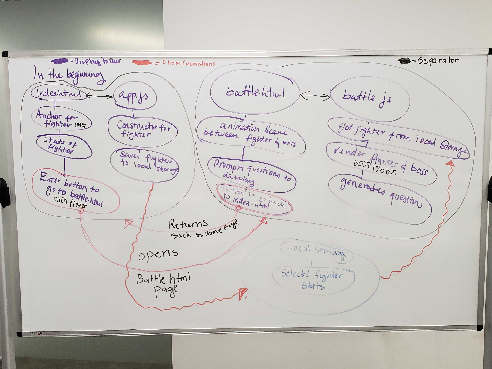

# codeFighters

codefellows201-seattle201d59

<<<<<<< HEAD
Feb 22 time 1248 - updated the folde structor of codeFighters. Added index.html, style.css, apps.js, and folder-img. HTML elements have been added as the initial structor of the user display. there are Two images displayed currently for visual representation only.

=======

Feb 22, Saturday time 1248 - updated the folde structor of codeFighters. Added index.html, style.css, apps.js, and folder-img
>>>>>>> f24c1dfb1a8ffa215bfee245e9f1ee23a8441383

Feb 24, Monday 1049. Made changes to apps.js, style.css, and html. Also uploads project prep #4. 

[User Stories](https://repl.it/@jpchato/User-stories)

Feb 22, Monday 1159 added Yasir js files and html.
  * Created questions 
  * Characters are rendering on both HTML sites
  * Both HTML files have been created (no styling)
  * Questions are getting the right answer but its not breaking when HP hits 0
  
  Tomorrow will work on 
  * work on the characters stats to render on the 
  * Merging the data files and complete the render of player cards on html files.
  * Work on styling.
